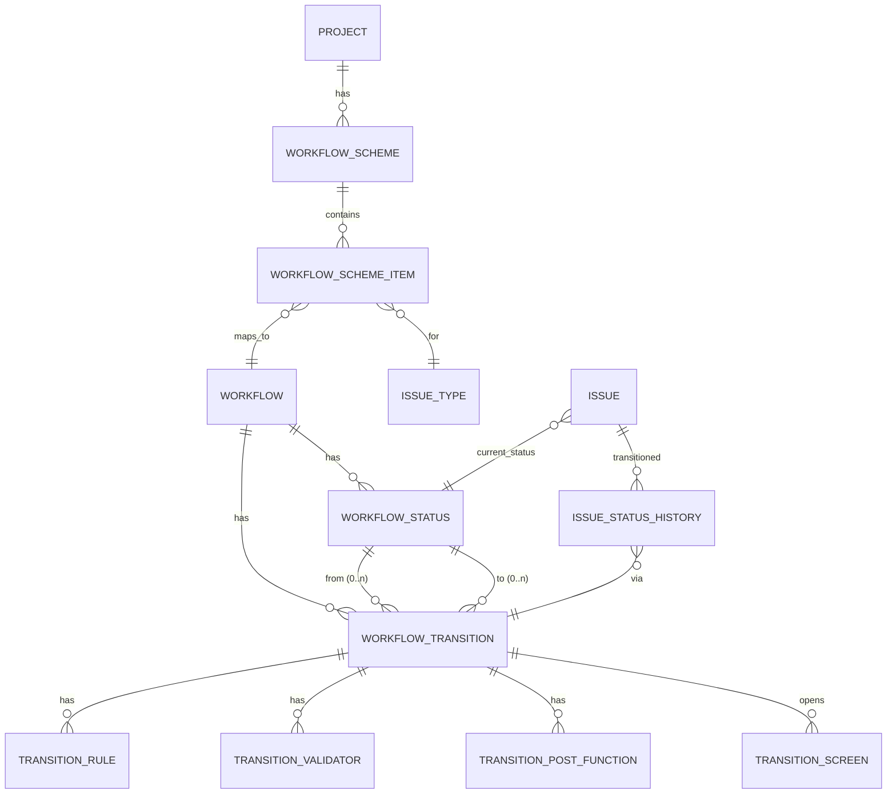
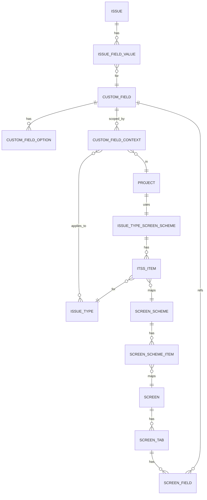

# Jira-Clone — Roadmap & Progress

> **Tài liệu này là nguồn duy nhất (single source of truth) để theo dõi quy trình build Jira-Clone.**
> Mỗi item có checkbox: `[ ]` chưa làm — `[~]` đang làm — `[x]` xong.
> Khi hoàn thành một item, đánh dấu `[x]` và ghi commit/PR liên quan ở cột "Note" (nếu có).
> Cập nhật file này mỗi khi xong một mốc.

**Stack**: .NET 8 (Layered, no CQRS) + Angular 18+ PrimeNG v18 + PostgreSQL **hoặc** Oracle (config-switch)
**Theme**: Monochrome trắng/đen
**i18n**: vi (default) / en
**Cập nhật lần cuối**: 2026-05-01

---

## 0. Tổng quan tiến độ

| Phase | Mục tiêu | Trạng thái |
|---|---|---|
| P0 | Bootstrap solution + BuildingBlocks (đã commit ban đầu) | `[x]` |
| P1 | Bổ sung BuildingBlocks còn thiếu | `[~]` đã xong 9/12, còn #4 (Outbox processor), #8 (Specification), #12 (Migration runner) |
| P1.6 | FE foundation (layout hybrid + 5 API services + 6 feature pages) | `[x]` Build PASS, end-to-end với BE qua nginx proxy |
| P2 | Module Workflow Engine | `[x]` Domain + App + Infra + Api + Seeder + IWorkflowProvisioner (auto-clone template cho project mới) + 15 unit test PASS |
| P3 | Module CustomField + Screen | `[~]` CustomField (definition + options + contexts + EAV value + 13 type handlers) ✅ — Screen / ScreenScheme defer P10. 20 unit test PASS |
| P4 | Module Project + Workspace | `[x]` Workspace + Project + IssueType + IPermissionChecker impl + IIssueTypeReader contract + IIssueNumberAllocator. 19 unit test PASS |
| P5 | Module Issue (dùng Workflow + Field) | `[x]` Issue domain + service tích hợp 4 module. 15 unit test PASS. **Smoke test docker compose: login → workspace → project → issue → transition PASS.** |
| P5.5 | End-to-end smoke test + docker compose | `[x]` Stack `postgres + api + web` chạy được, FE↔BE qua nginx proxy `/api/`. Branch merged vào main (commit 6cfd6e4) |
| P6 | Board Kanban (drag-drop, signal-based) | `[~]` BoardPageComponent với CDK drag-drop, optimistic update + rollback nếu transition fail. Route `/projects/:projectKey/board`. Còn: filter assignee/issueType, swimlanes, polling/realtime |
| P7 | Comment + Attachment + Activity Log | `[ ]` |
| P8 | Sprint + Backlog | `[ ]` |
| P9 | Search + Filter (incl. custom field) + Notification | `[ ]` |
| P10 | Workflow Editor UI + Field Editor UI | `[ ]` |
| P11 | Identity hoàn thiện (RBAC + Permission scheme) | `[ ]` |
| P12 | Docker Compose + CI + Docs | `[~]` Docker compose dev OK. Còn CI + production docker + README hướng dẫn |

---

## 1. Liệt kê tính năng Jira cần clone

### 1.1. Core MVP

- [ ] **Auth & User**: đăng ký/đăng nhập, JWT + refresh token, profile, avatar
- [ ] **Workspace / Organization**: multi-tenant, mời thành viên, role org-level
- [ ] **Project**: tạo project (Scrum/Kanban), key (`PRJ`), avatar, lead, member + role
- [ ] **Issue (trái tim)**:
  - [ ] CRUD issue, key auto `PRJ-123`
  - [ ] Issue type: Epic, Story, Task, Bug, Sub-task
  - [ ] Field cơ bản: summary, description (rich text), status, priority, assignee, reporter, labels, due date, story points, time tracking
  - [ ] Parent/child (sub-task, epic link)
  - [ ] Attachment, comment (mention `@user`)
  - [ ] Activity log / history
  - [ ] Watcher
- [ ] **Workflow & Status**: To Do → In Progress → Done, custom workflow per project, transition rule (chi tiết §3)
- [ ] **Custom Field per project** (chi tiết §4)
- [ ] **Board**:
  - [ ] Kanban: cột theo status, drag-drop
  - [ ] Scrum: backlog + sprint, burndown
- [ ] **Backlog**: list issue chưa vào sprint, drag vào sprint
- [ ] **Search & JQL-lite**: filter cơ bản (assignee, status, type, label, text), lưu filter
- [ ] **Notification**: in-app + email (mention, assign, status change)
- [ ] **Dashboard**: widget cơ bản (my issues, recent activity, sprint progress)

### 1.2. Nâng cao (sau MVP)

- [ ] Roadmap (timeline epic)
- [ ] Report (velocity, burndown, CFD)
- [ ] Permission scheme phức tạp
- [ ] Automation rule
- [ ] Webhook
- [ ] REST API public
- [ ] Import/Export
- [ ] Version/Release
- [ ] Component
- [ ] Wiki/Confluence-lite

### 1.3. Cross-cutting

- [ ] Realtime (SignalR) cho board drag-drop & comment
- [ ] File storage (S3-compat / local filesystem)
- [ ] Audit log (qua domain events + outbox)
- [x] i18n vi/en (BB.Localization đã có)
- [x] Theme monochrome (sẽ dùng PrimeNG Aura override)
- [x] TraceId xuyên suốt (BB.Web đã có)

---

## 2. BuildingBlocks — đánh giá hiện trạng & việc cần làm

### 2.1. Đã có

- [x] `BB.Common`: `BaseEntity`, `AuditableEntity`, `IAuditable`, `ISoftDeletable`, `IEntityWithTrace`, `Result<T>`, `PagedList<T>`, `PagedRequest`, `DomainException`
- [x] `BB.Persistence`: `BaseDbContext` (auditing + DateTimeOffset/bool conversion), `IRepository<T>`, `Repository<T>`, `IUnitOfWork`, `UnitOfWork<T>`, `DatabaseOptions`, `DbContextOptionsExtensions`
- [x] `BB.Web`: `ApiResponse<T>`, `BaseController`, `CorrelationContext`, `TraceIdMiddleware`, `GlobalExceptionHandler`
- [x] `BB.EventBus`: `IIntegrationEvent`, `IEventBus`, `InMemoryEventBus`, `IOutboxStore` (interface only)
- [x] `BB.Localization`: `IAppLocalizer` + JSON loader
- [x] `BB.Security`: `JwtOptions`, `JwtTokenService`, `ICurrentUser`
- [x] `BB.Logging`: Serilog ext

### 2.2. Còn thiếu — ưu tiên thực hiện trước Workflow + CustomField

> Mỗi item có **độ ưu tiên**: 🔴 = bắt buộc trước P2/P3 — 🟡 = nên có sớm — 🟢 = sau cũng được.

| # | Item | Ưu tiên | Đặt ở đâu | Ghi chú | Trạng thái |
|---|---|---|---|---|---|
| 1 | `IJsonColumn` abstraction + 2 impl (Postgres `jsonb`, Oracle `CLOB IS JSON`) | 🔴 | `BB.Persistence/Json/IJsonColumn.cs` | Domain CustomFieldValue lưu JSON, CLAUDE.md §2.4 cấm domain biết `jsonb` | `[x]` |
| 2 | Soft-delete query filter tự động cho `ISoftDeletable` | 🔴 | `BB.Persistence/BaseDbContext.cs` (`OnModelCreating` + `ApplySoftDelete`) | Workflow/Status/Field bị xoá là soft-delete (issue cũ vẫn ref) | `[x]` |
| 3 | `IDomainEvent` + dispatcher trong `SaveChangesAsync` | 🔴 | `BB.Common/DomainEvents.cs` + `BB.EventBus/DomainEventDispatcher.cs` | Khác `IIntegrationEvent` (cross-module). Dùng cho `IssueTransitioned` | `[x]` |
| 4 | `OutboxMessage` entity + `OutboxProcessor` (BackgroundService) | 🟡 | `BB.EventBus/Outbox/` | Entity đã có. Processor (BackgroundService) defer đến khi cần publish integration event (P9) | `[~]` entity-only |
| 5 | `ICacheService` (wrap `IDistributedCache`) | 🟡 | `BB.Common/Caching/` | Workflow/Field def đọc cực nhiều — phải cache theo `projectId`. Có sẵn `CacheKeys` helper | `[x]` |
| 6 | `IClock` (ISystemClock) | 🔴 | `BB.Common/Clock.cs` | Test workflow transition time, SLA cần mock | `[x]` |
| 7 | `IGuidGenerator` (UUID v7) | 🟡 | `BB.Common/Ids.cs` | RFC 9562 v7, time-ordered | `[x]` |
| 8 | `Specification<T>` pattern | 🟢 | `BB.Persistence/Specifications/` | Issue search filter động + custom field rất phức tạp | `[ ]` defer P9 |
| 9 | `IPermissionChecker` | 🔴 | `BB.Security/IPermissionChecker.cs` | Có sẵn `PermissionKeys` + `Roles` constants | `[x]` |
| 10 | `AggregateRoot` + collection domain events | 🔴 | `BB.Common/AggregateRoot.cs` | Có `RaiseDomainEvent`, `DomainEvents`, `ClearDomainEvents` | `[x]` |
| 11 | `ValueObject` base | 🟡 | `BB.Common/ValueObject.cs` | Equality theo components | `[x]` |
| 12 | Migration runner cho 2 provider + lệnh `make migrate-postgres` / `make migrate-oracle` | 🟡 | `Bootstrapper/Api.Host` startup hooks + `Taskfile` | Defer đến khi có module có entity thật (P2) | `[ ]` |

**Thứ tự đề xuất (làm gối đầu được):**

1. `[ ]` 🔴 #10 `AggregateRoot` + #3 `IDomainEvent` dispatcher (cùng nhóm, làm chung)
2. `[ ]` 🔴 #1 `IJsonColumn` (quan trọng nhất, ảnh hưởng schema CustomFieldValue)
3. `[ ]` 🔴 #6 `IClock` + #7 `IGuidGenerator`
4. `[ ]` 🔴 #2 Soft-delete filter
5. `[ ]` 🔴 #9 `IPermissionChecker`
6. `[ ]` 🟡 #5 `ICacheService` + #11 `ValueObject`
7. `[ ]` 🟡 #4 Outbox impl + #12 Migration runner
8. `[ ]` 🟢 #8 `Specification<T>`

---

## 3. Domain Design — Workflow Engine (P2)

### 3.1. ERD



### 3.2. Entity classes (sketch)

```csharp
public enum StatusCategory { ToDo = 1, InProgress = 2, Done = 3 }

// Aggregate root
public sealed class Workflow : AggregateRoot, ISoftDeletable
{
    public Guid? ProjectId { get; private set; }   // null = global template
    public string Name { get; private set; }
    public string Key { get; private set; }
    public string? Description { get; private set; }
    public bool IsTemplate { get; private set; }
    public bool IsActive { get; private set; }
    public Guid InitialStatusId { get; private set; }
    public bool IsDeleted { get; set; }
    public DateTimeOffset? DeletedAt { get; set; }
    public string? DeletedBy { get; set; }

    public IReadOnlyList<WorkflowStatus> Statuses { get; }
    public IReadOnlyList<WorkflowTransition> Transitions { get; }

    public static Workflow CreateForProject(Guid projectId, string name, string key);
    public WorkflowStatus AddStatus(string name, StatusCategory cat, string? color, int order);
    public WorkflowTransition AddTransition(Guid? fromStatusId, Guid toStatusId, string name);
    public void RemoveStatus(Guid statusId);
    public void SetInitialStatus(Guid statusId);
}

public sealed class WorkflowStatus : BaseEntity
{
    public Guid WorkflowId { get; private set; }
    public string Name { get; private set; }
    public string Key { get; private set; }
    public StatusCategory Category { get; private set; }
    public string? Color { get; private set; }
    public int Order { get; private set; }
    public bool IsFinal { get; private set; }
}

public sealed class WorkflowTransition : BaseEntity
{
    public Guid WorkflowId { get; private set; }
    public Guid? FromStatusId { get; private set; }   // null = "Any status" (global)
    public Guid ToStatusId { get; private set; }
    public string Name { get; private set; }
    public Guid? ScreenId { get; private set; }
    public bool IsAutomatic { get; private set; }

    public IReadOnlyList<TransitionRule> Rules { get; }
    public IReadOnlyList<TransitionValidator> Validators { get; }
    public IReadOnlyList<TransitionPostFunction> PostFunctions { get; }
}

public abstract class TransitionStep : BaseEntity
{
    public Guid TransitionId { get; protected set; }
    public string TypeKey { get; protected set; }     // "PERMISSION", "FIELD_REQUIRED", "ASSIGN_TO_REPORTER"
    public string ConfigJson { get; protected set; }  // qua IJsonColumn
    public int Order { get; protected set; }
}
public sealed class TransitionRule : TransitionStep { }
public sealed class TransitionValidator : TransitionStep { }
public sealed class TransitionPostFunction : TransitionStep { }

public sealed class WorkflowScheme : AggregateRoot
{
    public Guid ProjectId { get; private set; }
    public string Name { get; private set; }
    public Guid DefaultWorkflowId { get; private set; }
    public IReadOnlyList<WorkflowSchemeItem> Items { get; }
}
public sealed class WorkflowSchemeItem : BaseEntity
{
    public Guid SchemeId { get; private set; }
    public Guid IssueTypeId { get; private set; }
    public Guid WorkflowId { get; private set; }
}

public sealed class IssueStatusHistory : BaseEntity
{
    public Guid IssueId { get; private set; }
    public Guid? FromStatusId { get; private set; }
    public Guid ToStatusId { get; private set; }
    public Guid TransitionId { get; private set; }
    public string ChangedBy { get; private set; }
    public DateTimeOffset ChangedAt { get; private set; }
    public string? Comment { get; private set; }
}
```

### 3.3. Strategy registry (Application layer)

```csharp
public interface ITransitionRule { string TypeKey { get; } Task<bool> EvaluateAsync(TransitionContext ctx, JsonElement config, CancellationToken ct); }
public interface ITransitionValidator { string TypeKey { get; } Task<Result> ValidateAsync(TransitionContext ctx, JsonElement config, CancellationToken ct); }
public interface ITransitionPostFunction { string TypeKey { get; } Task ExecuteAsync(TransitionContext ctx, JsonElement config, CancellationToken ct); }
```

**Built-in steps:**

- Rules: `PERMISSION_RULE`, `USER_IS_ASSIGNEE`, `USER_IN_GROUP`
- Validators: `FIELD_REQUIRED`, `FIELD_HAS_VALUE`, `REGEX_MATCH`, `RESOLUTION_REQUIRED`
- PostFunctions: `ASSIGN_TO_CURRENT_USER`, `ASSIGN_TO_REPORTER`, `SET_FIELD_VALUE`, `CLEAR_FIELD`, `FIRE_EVENT`, `ADD_COMMENT`

### 3.4. Engine flow `WorkflowEngine.TransitionAsync`

```
1. Load Issue + current status + Workflow
2. Verify transition.FromStatusId == issue.StatusId (hoặc null = global)
3. Run all Rules → fail bất kỳ → 403 Forbidden
4. Run all Validators → fail → 400 + ResultError list
5. Apply field changes từ inputs (transition screen)
6. Set Issue.StatusId = transition.ToStatusId
7. Run all PostFunctions (order asc)
8. Append IssueStatusHistory
9. Raise domain event IssueTransitioned (→ activity, notification)
10. SaveChangesAsync (1 transaction)
```

### 3.5. Checklist P2 — Workflow Engine

- [x] Tạo `Modules/Workflow/Workflow.Domain`: entities theo §3.2 (commit 43746cb)
- [x] Tạo `Modules/Workflow/Workflow.Application`: `IWorkflowService`, `IWorkflowEngine`, `TransitionContext`, registries (commit 43746cb)
- [x] Built-in `ITransitionRule` impls: PERMISSION_RULE, USER_IS_ASSIGNEE, USER_IN_ROLE
- [x] Built-in `ITransitionValidator` impls: FIELD_REQUIRED, REGEX_MATCH, RESOLUTION_REQUIRED
- [x] Built-in `ITransitionPostFunction` impls: ASSIGN_TO_CURRENT_USER, SET_FIELD_VALUE, CLEAR_FIELD
- [x] Tạo `Workflow.Infrastructure`: `WorkflowDbContext` (schema `workflow`), 3 repos, UoW, design-time factory
- [~] Migrations: Postgres ✅ (`InitWorkflow_Postgres`). Oracle ⏳ defer cùng BB#12 (cần `IMigrationsAssembly` filter theo provider)
- [x] Tạo `Workflow.Api`: `WorkflowsController` (designer CRUD: workflow + status + transition + step), `TransitionsController` (engine: available + execute), `WorkflowModule` DI extension
- [x] Wire vào `Api.Host/Program.cs` + register `IClock` + `IGuidGenerator` + `IDomainEventDispatcher`
- [x] Seed default workflow template "SOFTWARE_SIMPLE" (To Do → In Progress → Done + global Force Close)
- [x] Unit test (15 tests, all PASS): domain invariants (7) + built-in validators (5) + post-functions (3)
- [ ] Integration test: transition end-to-end (Postgres matrix) — defer cùng BB#12

---

## 4. Domain Design — CustomField Engine (P3)

### 4.1. ERD



### 4.2. Entity classes (sketch)

```csharp
public enum CustomFieldType
{
    Text = 1, TextArea = 2, Number = 3, Decimal = 4,
    Date = 5, DateTime = 6,
    Select = 10, MultiSelect = 11, Cascading = 12,
    User = 20, UserMulti = 21,
    Checkbox = 30, Url = 31, Label = 32,
    SystemReserved = 99
}

public sealed class CustomField : AggregateRoot, ISoftDeletable
{
    public string Key { get; private set; }            // immutable, dùng cho API/JQL
    public string Name { get; private set; }
    public string? Description { get; private set; }
    public CustomFieldType Type { get; private set; }
    public bool IsSystem { get; private set; }         // built-in field không xoá được
    public bool IsSearchable { get; private set; }
    public string ConfigJson { get; private set; }     // type-specific config
    public bool IsDeleted { get; set; }
    public DateTimeOffset? DeletedAt { get; set; }
    public string? DeletedBy { get; set; }
    public IReadOnlyList<CustomFieldOption> Options { get; }
}

public sealed class CustomFieldOption : BaseEntity
{
    public Guid CustomFieldId { get; private set; }
    public Guid? ParentOptionId { get; private set; }  // cascading
    public string Value { get; private set; }
    public string Label { get; private set; }
    public int Order { get; private set; }
    public bool IsDisabled { get; private set; }
}

public sealed class CustomFieldContext : BaseEntity
{
    public Guid CustomFieldId { get; private set; }
    public string Name { get; private set; }
    public bool IsGlobal { get; private set; }
    public bool IsRequired { get; private set; }
    public string? DefaultValueJson { get; private set; }
    public List<Guid> ProjectIds { get; private set; }    // jsonb
    public List<Guid> IssueTypeIds { get; private set; }  // rỗng = mọi type
}

public sealed class Screen : AggregateRoot
{
    public string Name { get; private set; }
    public string? Description { get; private set; }
    public IReadOnlyList<ScreenTab> Tabs { get; }
}
public sealed class ScreenTab : BaseEntity
{
    public Guid ScreenId { get; private set; }
    public string Name { get; private set; }
    public int Order { get; private set; }
    public IReadOnlyList<ScreenField> Fields { get; }
}
public sealed class ScreenField : BaseEntity
{
    public Guid TabId { get; private set; }
    public Guid CustomFieldId { get; private set; }
    public int Order { get; private set; }
}

public enum ScreenOperation { Create = 1, Edit = 2, View = 3 }

public sealed class ScreenScheme : AggregateRoot
{
    public string Name { get; private set; }
    public Guid DefaultScreenId { get; private set; }
    public IReadOnlyList<ScreenSchemeItem> Items { get; }
}
public sealed class ScreenSchemeItem : BaseEntity
{
    public Guid ScreenSchemeId { get; private set; }
    public ScreenOperation Operation { get; private set; }
    public Guid ScreenId { get; private set; }
}

public sealed class IssueTypeScreenScheme : AggregateRoot
{
    public Guid ProjectId { get; private set; }
    public string Name { get; private set; }
    public Guid DefaultScreenSchemeId { get; private set; }
    public IReadOnlyList<IssueTypeScreenSchemeItem> Items { get; }
}
public sealed class IssueTypeScreenSchemeItem : BaseEntity
{
    public Guid IssueTypeScreenSchemeId { get; private set; }
    public Guid IssueTypeId { get; private set; }
    public Guid ScreenSchemeId { get; private set; }
}

// EAV value
public sealed class IssueFieldValue : BaseEntity
{
    public Guid IssueId { get; private set; }
    public Guid CustomFieldId { get; private set; }
    public string ValueJson { get; private set; }   // qua IJsonColumn — { "v": ... }
    // Denormalized indexes (chỉ điền khi field IsSearchable)
    public string? IndexedString { get; private set; }
    public decimal? IndexedNumber { get; private set; }
    public DateTimeOffset? IndexedDate { get; private set; }
}
```

### 4.3. Strategy registry

```csharp
public interface ICustomFieldTypeHandler
{
    CustomFieldType Type { get; }
    Task<Result> ValidateAsync(CustomField def, JsonElement value, CancellationToken ct);
    JsonElement Normalize(JsonElement input);
    (string? indexedString, decimal? indexedNumber, DateTimeOffset? indexedDate) Index(JsonElement value);
    object? ProjectForApi(JsonElement value);
}
```

### 4.4. Resolve flow

**Khi Issue Create / Edit:**
```
1. Resolve IssueTypeScreenScheme(project, issueType)
     → ScreenScheme(operation=Create|Edit) → Screen → ScreenField list
2. Với mỗi ScreenField:
     - Lookup CustomField + CustomFieldContext.IsRequired
     - Validate input qua handler.ValidateAsync
3. Persist IssueFieldValue rows + indexed columns
```

**Khi Workflow Validator FIELD_REQUIRED:**
```
1. Resolve Screen của transition (nếu có) hoặc Screen Edit mặc định
2. Check IssueFieldValue tồn tại + non-empty (qua handler)
```

### 4.5. Search trên custom field (P9)

- Field `IsSearchable=true` → ghi `IndexedString/Number/Date` → index B-tree `(CustomFieldId, IndexedString)`
- JQL-lite parser → SQL `WHERE EXISTS (SELECT 1 FROM issue_field_value v WHERE v.issue_id = i.id AND v.custom_field_id = @id AND v.indexed_string = @value)`
- Field không searchable → cấm filter, báo `field.not.searchable`

### 4.6. Checklist P3 — CustomField + Screen

- [x] Tạo `Modules/CustomField/CustomField.Domain`: CustomField (aggregate root), CustomFieldOption, CustomFieldContext, IssueFieldValue
- [x] Tạo `Modules/CustomField/CustomField.Application`:
  - [x] `ICustomFieldService`, `IIssueFieldValueService`
  - [~] Screen / ScreenScheme / IssueTypeScreenScheme — **defer P10** (UI designer phase, không cần cho Issue MVP)
  - [x] Registry `ICustomFieldTypeHandler` + 13 built-in handlers
- [x] Tạo `CustomField.Infrastructure`: DbContext (schema `custom_field`), `IJsonColumn` binding cho ValueJson + DefaultValueJson, List&lt;Guid&gt; converter cho ProjectIds/IssueTypeIds, Postgres migration
- [x] Tạo `CustomField.Api`: `CustomFieldsController`, `IssueFieldValuesController`, `CustomFieldModule` DI extension
- [ ] Seed system fields (Summary, Description, Priority…) — defer cùng P5 Issue (system fields gắn với Issue domain hơn là Field domain)
- [x] Unit test: 8 domain invariants + 9 handler tests + 3 registry/index tests = 20 PASS
- [ ] Integration test — defer cùng BB#12

---

## 5. Module breakdown đầy đủ

```
src/
├── BuildingBlocks/                 (P0/P1)
│   ├── BB.Common/
│   ├── BB.Persistence/
│   ├── BB.EventBus/
│   ├── BB.Web/
│   ├── BB.Localization/
│   ├── BB.Logging/
│   ├── BB.Security/
│   └── BB.Caching/                 ← thêm ở P1
├── Modules/
│   ├── Identity/                   (P11)
│   ├── Workspace/                  (P4)
│   ├── Project/                    (P4)
│   ├── Workflow/                   (P2) — phụ thuộc IssueType từ Project
│   ├── CustomField/                (P3) — phụ thuộc IssueType từ Project
│   ├── Issue/                      (P5) — phụ thuộc Workflow + CustomField
│   ├── Board/                      (P6)
│   ├── Sprint/                     (P8)
│   ├── Comment/                    (P7)
│   ├── Attachment/                 (P7)
│   ├── ActivityLog/                (P7)
│   ├── Search/                     (P9)
│   └── Notification/               (P9)
├── Bootstrapper/
│   └── Api.Host/
tests/
├── UnitTests/
└── IntegrationTests/
```

> **Nguyên tắc phụ thuộc**: module phụ thuộc nhau qua **Application interface**, không tham chiếu Infrastructure. Workflow + CustomField cần `IssueTypeId` → định nghĩa interface `IIssueTypeReader` ở Application của Project, hai module Workflow/CustomField inject interface này.

---

## 6. Frontend — Layout & Navigation

### 6.1. Quyết định: **Hybrid (Top bar + Left sidebar contextual + responsive)**

| Vùng | Vị trí | Kích thước | Nội dung |
|---|---|---|---|
| **Top bar** | top, fixed | 48px | `[≡]` toggle sidebar, Logo, WorkspaceSwitcher, GlobalSearch (⌘K), `[+ Create]`, 🔔 Notifications, Language switcher (vi/en), 👤 Profile menu |
| **Left sidebar** | left, fixed | 64px collapsed / 240px expanded / drawer trên mobile | **Contextual** đổi theo route:<br>• Workspace level: Home, Projects, People, Settings<br>• Project level (`/projects/:key/...`): Board, Backlog, Roadmap, Issues, Reports, Releases, Code, Settings |
| **Breadcrumb** | dưới topbar | 32px | Workspace › Project › Section |
| **Main** | còn lại | flex | router-outlet |

**Responsive:**
- ≥ 1024px: sidebar collapsed (icon only) mặc định, hover/click pin → expanded
- 768–1023px: sidebar collapsed luôn
- < 768px: sidebar drawer overlay (toggle bằng `[≡]` ở topbar)

**Theme:** monochrome (CLAUDE.md §3.6). Active item: border-left 2px đen + text bold + bg `--c-surface`. Hover: bg `--c-surface`. Không gradient, không màu accent.

### 6.2. Component cần có (`core/layout/`)

- [ ] `app-shell` — layout container
- [ ] `app-topbar`
- [ ] `app-sidebar` (signal-based, contextual qua `currentProject()` + route)
- [ ] `app-breadcrumb`
- [ ] `app-workspace-switcher`
- [ ] `app-global-search` (⌘K)
- [ ] `app-create-button` (dropdown: New Issue / Project / Sprint…)
- [ ] `app-notification-bell` (dropdown + count badge)
- [ ] `app-language-switcher`
- [ ] `app-profile-menu`

### 6.3. Checklist FE foundation (P1 cùng nhánh)

- [x] Setup Angular 18 standalone + signals + control flow mới
- [x] PrimeNG v18 + theme Aura override monochrome
- [x] @ngx-translate setup vi/en
- [x] `core/http/` interceptors: trace-id, auth, loading, api-response, error
- [x] `core/notification/` `NotificationService` (Toast success) + `ErrorDialog` (modal blocking, copy TraceId)
- [x] `app-shell` layout (theo §6.1) — Top bar (48px) + Left sidebar contextual (240/56px) + responsive
- [x] API services cho 5 module BE: Workspace, Project, Issue, Workflow, CustomField
- [x] Feature pages: Workspaces (list+create), Workspace detail, Projects, Project detail, Issues (search), Issue detail (with transition buttons)
- [~] `shared/ui/` 25 base components — chỉ có `app-page-header` cho MVP, các component khác dùng PrimeNG trực tiếp (defer P10)
- [x] Router structure: `/workspaces`, `/workspaces/:slug`, `/projects/:projectKey`, `/issues`, `/issues/:issueKey`
- [x] Route guard `AuthGuard` (đã có)
- [ ] Dark mode toggle UI — CSS đã sẵn `[data-theme="dark"]`, chưa có nút toggle (defer)

---

## 7. Convention reminders (rút từ CLAUDE.md, không repeat đầy đủ)

- Comment: VN cho business logic, EN cho code/log/exception
- Naming: `PascalCase` C# / `camelCase` TS / `kebab-case` file FE / `snake_case` DB column
- Branch: `feat/*`, `fix/*`, `chore/*` — base `develop`, release `main`
- Commit: Conventional Commits
- Mọi response BE qua `ApiResponse<T>` chuẩn (CLAUDE.md §2.6)
- Mọi error BE → `messageKey` (FE translate) + `traceId`
- FE: success bằng Toast, error bằng `ErrorDialog` blocking

---

## 8. Quyết định kiến trúc (đã chốt — 2026-05-01)

| # | Quyết định | Phương án | Trạng thái |
|---|---|---|---|
| D1 | **CFV storage** | EAV + JSON column (qua `IJsonColumn`) + 3 indexed columns (`IndexedString`, `IndexedNumber`, `IndexedDate`) cho field `IsSearchable=true` | ✅ chốt |
| D2 | **Workflow scope** | Project-scoped. `Workflow.IsTemplate=true` cho phép clone sang project khác. Có thể migrate sang shared model sau MVP nếu cần | ✅ chốt |
| D3 | **Transition step model** | Strategy pattern + registry. 3 interface `ITransitionRule` / `ITransitionValidator` / `ITransitionPostFunction`, mỗi step có `TypeKey` + `ConfigJson`. Built-in steps đăng ký qua DI `IEnumerable<>` | ✅ chốt |
| D4 | **Realtime** | Polling-based ở MVP (P5–P9). SignalR phase ≥ P11 | ✅ chốt |
| D5 | **File storage** | Abstraction `IFileStorage` trong BB. Impl: `LocalFileStorage` (dev), `S3FileStorage` (prod) — dùng `AWSSDK.S3` (S3 protocol → MinIO/S3/Wasabi compatible) | ✅ chốt |
| D6 | **Permission scheme MVP** | 4 role cố định: Org `Owner`; Project `Admin` / `Member` / `Viewer`. `IPermissionChecker` abstract sẵn để swap sang full scheme phase ≥ P11 | ✅ chốt |

---

## 9. History (mỗi lần update file này, ghi 1 dòng)

| Date | Author | Note |
|---|---|---|
| 2026-05-01 | claude | Init doc — liệt kê features, đánh giá BB, design Workflow + CustomField, quyết định FE layout |
| 2026-05-01 | claude | Lock 6 quyết định kiến trúc (D1–D6) ở §8. Sẵn sàng bắt đầu P1 |
| 2026-05-01 | claude | P1 ✅ 9/12 BB items: AggregateRoot, IDomainEvent + dispatcher, IClock, IGuidGenerator (UUID v7), ValueObject, IJsonColumn, soft-delete filter, IPermissionChecker, ICacheService. Build solution PASS. (commit e505a04) |
| 2026-05-01 | claude | P2 partial — Workflow Domain + Application + 9 built-in steps. Build PASS. (commit 43746cb) |
| 2026-05-01 | claude | P2 — thêm Infrastructure (DbContext, 3 repos, factory, Postgres migration, seeder), Api (2 controller + module DI). Wire vào Api.Host. Build sln PASS. (commit acf0960) |
| 2026-05-01 | claude | P2 ✅ — thêm 15 unit test (domain invariants + built-in validators/post-functions), all PASS. P2 hoàn tất ngoại trừ Oracle migration + integration test. (commit b6f3230) |
| 2026-05-01 | claude | P4 ✅ — Module Project: Workspace + Project + IssueType (auto-seed 5 type) + RoleBasedPermissionChecker (impl D6) + IIssueTypeReader contract. Postgres migration + 19 unit test PASS. Wire vào Api.Host. (commit 4c2e821) |
| 2026-05-01 | claude | P3 partial — Module CustomField: 4 entity (CustomField, Option, Context, IssueFieldValue) + 13 type handlers + EAV with indexed columns + 2 service + 2 controller. Postgres migration + 20 unit test PASS. Screen/ScreenScheme defer P10. Tổng 54/54 test PASS. (commit 45bb882) |
| 2026-05-01 | claude | P5 ✅ — Module Issue: domain (15 fields, 8 events) + IIssueNumberAllocator (Project), IWorkflowResolver (Workflow), tích hợp engine + CustomField. 15 unit test PASS. **Tổng 69/69 test PASS.** Issue MVP tạo được PRJ-N, transition qua engine, set field values, watcher auto-add assignee. (commit c0adc76) |
| 2026-05-02 | claude | FE foundation ✅ — Layout hybrid (top bar 48px + left sidebar contextual 240/56px) + 5 API services (Workspace, Project, Issue, Workflow, CustomField) + 6 feature pages (workspaces list/detail, projects list/detail, issues search, issue detail with transition). Angular build PASS, 7 lazy chunks. (commit 00d7778) |
| 2026-05-02 | claude | End-to-end smoke ✅ — Stack docker postgres+api+web chạy, smoke test PASS: admin login → tạo workspace `acme` → tạo project `DEMO` → tạo `DEMO-1` (auto-provision workflow scheme từ template SOFTWARE_SIMPLE) → transition Force Close → status Done. FE↔BE qua nginx proxy. Phát hiện gap → fix bằng IWorkflowProvisioner (commit 64d8625). Branch merged vào main (commit 6cfd6e4). |
| 2026-05-02 | claude | FE create flows ✅ — CreateProjectDialog (workspace detail), CreateIssueDialog (issues page + topbar global), StatusCacheService (resolve status name + category color). Topbar "+" mở dialog → sau khi tạo navigate đến `/issues/{key}`. Status pill dùng màu theo category (ToDo=xám / InProgress=xanh / Done=lục). (commit c05e0a3) |
| 2026-05-02 | claude | P6 partial — Board Kanban: `BoardPageComponent` dùng `@angular/cdk/drag-drop`. Cột theo workflow status, card = issue (key+pri+summary+assignee initials). Drop card sang cột khác → resolve transition phù hợp (qua /transitions/available) → call transition API. Optimistic UI: card di chuyển ngay, rollback nếu fail. Route `/projects/:projectKey/board`. |
